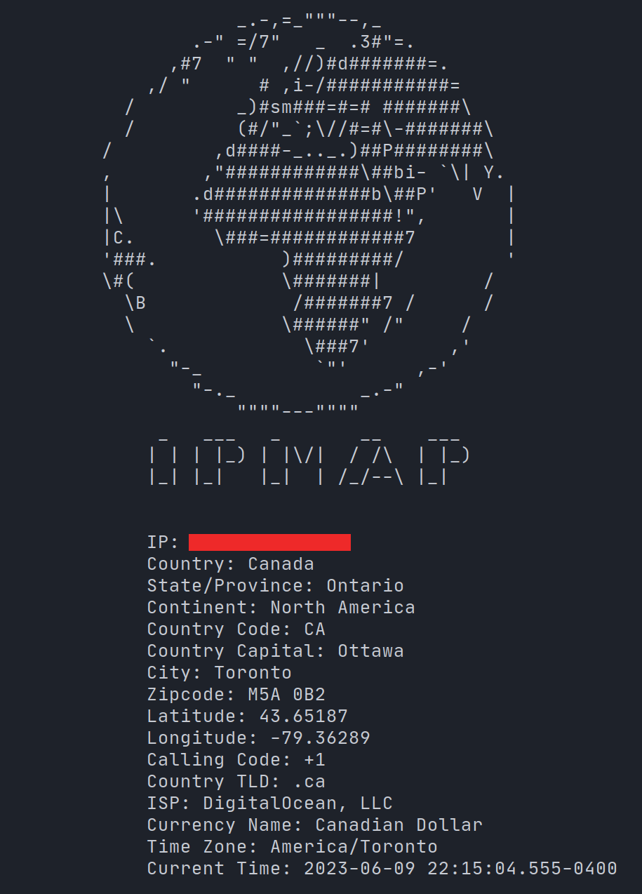

# IPMap

IPMap is a command-line tool for geolocating IP addresses using the IP Geolocation API. It provides detailed information about the given IP address, including its country, state/province, continent, latitude, longitude, timezone, and more.

## Prerequisites

Before using IPMap, make sure you have the following requirements met:

- Python 3.x installed on your system
- An API key from [IP Geolocation](https://ipgeolocation.io/) (sign up for a free account to obtain an API key)

## Installation

1. Clone this repository or download the script file (`ipmap.py`) to your local machine.
2. Open the `ipmap.py` file in a text editor and replace `'YOUR_API_KEY'` with your actual API key obtained from IP Geolocation.

## Usage

To use IPMap, follow these steps:

1. Open your terminal or command prompt.
2. Navigate to the directory where the `ipmap.py` script is located.
3. Run the script with the IP address as a command-line argument, like this:

python ipmap.py <IP_ADDRESS>

css

Replace `<IP_ADDRESS>` with the actual IP address you want to geolocate.

## Example

Here's an example of using IPMap to geolocate an IP address:

python ipmap.py XX.XXX.XX.XX

This will display detailed information about the IP address, such as its country, state/province, continent, latitude, longitude, timezone, and more.

## Limitations

- IPMap relies on the IP Geolocation API, so it's subject to any limitations or restrictions imposed by the API provider.
- The accuracy of geolocation results may vary depending on the IP Geolocation service used.